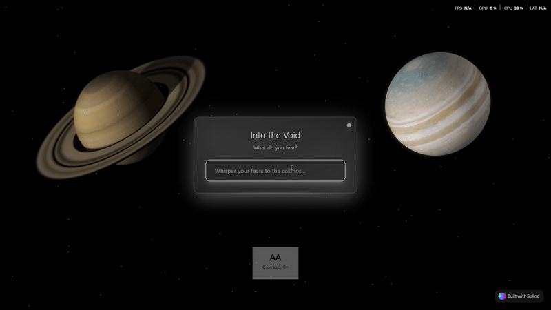

# 🌌 Zooming Out: A Scroll-Based Cosmic Perspective Experience

```
    ✧･ﾟ: *✧･ﾟ:*    *:･ﾟ✧*:･ﾟ✧
         ･ﾟ✧*:･ﾟ✧ ZOOMING OUT ✧･ﾟ: *✧･ﾟ:
    *:･ﾟ✧*:･ﾟ✧    Journey Through Scale    ✧･ﾟ: *✧･ﾟ:*
         ･ﾟ✧*:･ﾟ✧ & Perspective ✧･ﾟ: *✧･ﾟ:
    ✧･ﾟ: *✧･ﾟ:*    *:･ﾟ✧*:･ﾟ✧
```

<div align="center">

### 🎯 **Submitted for: #SplineHackathon**

</div>

---

## 🎬 Experience Preview

<div align="center">

### 🏠 Landing Page

*Welcome to the cosmic perspective journey*

### 💭 Fear Input Page

*Share what's weighing on your mind before we zoom out*

### 🌌 The Cosmic Journey

*Experience the complete zoom-out from Earth → Moon → Galaxy*

</div>

---

## 🧠 The Premise

> ### *"Why are you scared? Does it really matter?"*

<div align="center">

```
    You ──────────────────────── Your Problems Feel HUGE
     ↓                                    ↑
   Scroll                              But what if...
     ↓                                    ↑  
   Earth ─────────────────────── We zoomed out?
     ↓                                    ↑
   Space ──────────────────────── Everything changes
     ↓                                    ↑
  Galaxy ─────────────────────── Perspective shifts
```

</div>

**Zooming Out** is a scroll-driven web experience that takes you from your personal space to the cosmic scale, helping put your worries in perspective.

---

## 🚀 The Experience

### 🌍 **Stage 1: Local**
You start at your location - in this case, India (where this was developed). The camera focuses tight on your immediate world.

<details>
<summary>🔍 <strong>Click to see the local journey</strong></summary>

```
🏠 Your immediate space
  ↓ scroll reveals
🏘️ Your neighborhood  
  ↓ scroll reveals
🏙️ Your city context
  ↓ scroll reveals
🗺️ Your country borders
```

> *"Right now, you're here. And it feels like everything is closing in."*

</details>

### 🌎 **Stage 2: Earth**
The scroll begins. The view pulls back to show continents, oceans, and the blue marble of Earth.

<details>
<summary>🌍 <strong>Experience the Earth perspective</strong></summary>

```
         🌍 EARTH
      ╭─────────╮
     ╱  🏔️    🌊 ╲
    ╱     ☁️      ╲
   ╱  ☁️      🏔️  ╲
  ╱      🌊        ╲
 ╱  ☁️        ☁️   ╲
╱___________________╲
```

> *"Take a breath. From here, you're already just a pixel."*

</details>

### 🌕 **Stage 3: The Moon**
We leave Earth's orbit. You see the pale blue dot floating in the cosmic void.

<details>
<summary>🌙 <strong>View from lunar distance</strong></summary>

```
                    🌍 ← Earth
                      │
                      │ 384,400 km
                      │
    You are here → 🌙 ← Moon
                      
    From this distance, individual problems
    are invisible specks on a distant world
```

> *"Did you know the Moon is 384,400 km away? Even from here, your problems aren't visible."*

</details>

### 🌌 **Stage 4: The Galaxy**
Earth becomes a dot. The Solar System fades. Stars, constellations, and the Milky Way come into view.

<details>
<summary>⭐ <strong>Enter the galactic scale</strong></summary>

```
    🌌 THE MILKY WAY GALAXY 🌌
          ╭─────────────╮
        ╱ ⭐ ⭐ ⭐ ⭐ ⭐ ╲
      ╱ ⭐           ⭐ ╲
    ╱ ⭐    ☀️←You    ⭐ ╲
   ╱ ⭐               ⭐ ╲
  ╱   ⭐ ⭐ ⭐ ⭐ ⭐   ╱
 ╱_____________________╲
   100-400 billion stars
```

> *"There are 100–400 billion stars in our galaxy. And we're just one galaxy."*

</details>

---

## 💫 Final Message

<div align="center">

```
╔════════════════════════════════════════════════════════╗
║                                                        ║
║  "Zoom out.                                            ║
║                                                        ║
║   In the grand scale of the universe,                 ║
║   your fears are temporary,                           ║
║   your problems are tiny,                             ║
║                                                        ║
║   but your life? Your presence?                       ║
║   That's rare. That's beautiful.                      ║
║                                                        ║
║   So live fully. Think big. Worry less."              ║
║                                                        ║
╚════════════════════════════════════════════════════════╝
```

</div>

---

## 💻 Tech Stack & Design

<div align="center">

| Component | Technology |
|-----------|------------|
| **Frontend** | Vanilla HTML, CSS, JS |
| **3D Models** | Spline / Three.js |
| **Scroll Control** | Manual JS scroll handlers |
| **Design Tools** | Figma (UI) + Spline (Models) |
| **Development** | Built locally from scratch |

</div>

---

## 🌟 Interactive Elements

### 📜 **Scroll Interaction**
```javascript
// The core scroll experience
window.addEventListener('scroll', () => {
  const scrollPercent = window.scrollY / (document.body.scrollHeight - window.innerHeight);
  // Zoom level changes based on scroll position
  updateCosmicScale(scrollPercent);
});
```

### 🎮 **Progressive Reveal**
- **0-25% scroll**: Local to country view
- **25-50% scroll**: Earth from space  
- **50-75% scroll**: Moon distance perspective
- **75-100% scroll**: Galactic scale view

### 🌌 **Visual Transitions**
```css
/* Smooth cosmic transitions */
.cosmic-stage {
  transition: opacity 2s ease-in-out,
              transform 3s cubic-bezier(0.4, 0, 0.2, 1);
}

.zoom-container {
  transform-origin: center center;
  will-change: transform;
}
```

---

## 🖼️ 3D Assets Note

The `.glb` models used for Earth, Moon, Galaxy, etc., are **not attached** in this repository due to their large size (some files > 100MB). 

<details>
<summary>📦 <strong>Model specifications</strong></summary>

```
assets/models/
├── earth.glb     (~45MB) - Detailed Earth model
├── moon.glb      (~23MB) - Lunar surface model  
├── galaxy.glb    (~67MB) - Milky Way structure
└── stars.glb     (~12MB) - Background star field
```

Models can be shared separately on request for review or collaboration.

</details>

---

## 📦 Run Locally

```bash
# Clone the repository
git clone https://github.com/hanish9193/Zooming_Out.git

# Navigate to project
cd Zooming_Out

# Install dependencies  
npm install

# Start development server
npm run dev
```

### 🚀 **Quick Setup**
```bash
# Alternative simple setup
cd Zooming_Out
open index.html  # For simple file serving
# or
python -m http.server 8000  # For local server
```

---

## 🎨 Customization Options

### 🌍 **Change Starting Location**
```javascript
// In main.js - modify starting coordinates
const startLocation = {
  lat: 28.6139,  // Delhi coordinates (current)
  lng: 77.2090,
  zoom: 10
};
```

### 🎭 **Adjust Scroll Speed**
```javascript
// Control the zoom progression
const scrollConfig = {
  earthStage: { start: 0, end: 0.25 },
  moonStage: { start: 0.25, end: 0.5 },
  galaxyStage: { start: 0.5, end: 1.0 }
};
```

### 🌌 **Cosmic Colors**
```css
:root {
  --space-black: #000011;
  --cosmic-blue: #1a237e; 
  --star-white: #ffffff;
  --earth-blue: #4fc3f7;
}
```

---

## 🛠️ Project Structure

```
Zooming_Out/
├── 📄 index.html          # Main entry point
├── 🎨 styles/
│   ├── main.css           # Core styling
│   └── animations.css     # Scroll animations
├── ⚡ scripts/
│   ├── main.js            # Core logic
│   ├── scroll-handler.js  # Scroll interactions
│   └── spline-loader.js   # 3D model loading
├── 🌍 assets/
│   ├── models/            # 3D .glb files (not included)
│   └── images/            # UI images
└── 📦 package.json        # Dependencies
```

---

## 🌟 Experience the Scale

<div align="center">

```
Human Problems ────────────────────── Cosmic Perspective

😰 Exam stress                        ⭐ You're stardust
💔 Relationship issues               🌍 Temporary on a rock  
📉 Career setbacks                   🌌 In infinite space
⏰ Daily pressures                   ♾️ Brief cosmic moment

          ↓ SCROLL TO TRANSFORM ↓
     From overwhelming to manageable
```

</div>

### 🧘 **The Psychological Shift**
- **Overwhelmed** → **Perspective**
- **Trapped** → **Free** 
- **Huge problems** → **Manageable challenges**
- **Isolated** → **Connected to cosmos**

---

## 🎯 Interactive ASCII Visualization

<details>
<summary>🚀 <strong>Click to see the complete journey map</strong></summary>

```
ZOOMING OUT: The Complete Journey
═══════════════════════════════════

Stage 1: YOU
🏠 ← Start here (your location)
│
│ 🖱️ Scroll down
▼

Stage 2: LOCAL CONTEXT  
🏘️ Neighborhood
🏙️ City
🗺️ Country
│
│ 🖱️ Continue scrolling
▼

Stage 3: EARTH FROM SPACE
         🌍
      /       \
     /  🏔️ 🌊  \
    /     ☁️    \
   /   🌊   🏔️  \
  /       ☁️     \
 /_______________\
│
│ 🖱️ Keep scrolling
▼

Stage 4: LUNAR DISTANCE
                    🌍 ← Earth (now a dot)
                     │
                     │ 384,400 km
                     │
You're here → 🌙     │
               │
               │ 🖱️ Scroll more
               ▼

Stage 5: GALACTIC SCALE
    🌌 MILKY WAY GALAXY 🌌
          ╭─────────────╮
        ╱ ⭐ ⭐ ⭐ ⭐ ⭐ ╲
      ╱ ⭐           ⭐ ╲
    ╱ ⭐  ☀️(Earth)  ⭐ ╲
   ╱ ⭐               ⭐ ╲
  ╱   ⭐ ⭐ ⭐ ⭐ ⭐   ╱
 ╱_____________________╲
   100+ billion stars

Final Message:
╔═══════════════════════════════════╗
║ Your problems: temporary & tiny   ║
║ Your life: rare & beautiful       ║  
║ Perspective: everything           ║
╚═══════════════════════════════════╝
```

</details>

---

## 📊 Current Implementation

### ✅ **What's Built**
- [x] Scroll-driven zoom progression
- [x] 3D Earth, Moon, Galaxy models  
- [x] Smooth transitions between scales
- [x] Responsive text overlays
- [x] Local to cosmic journey
- [x] Final perspective message

### 🔧 **Technical Details**
```javascript
// Core scroll logic (simplified)
function handleScroll() {
  const progress = getScrollProgress();
  
  if (progress < 0.25) {
    showLocalStage(progress * 4);
  } else if (progress < 0.5) {  
    showEarthStage((progress - 0.25) * 4);
  } else if (progress < 0.75) {
    showMoonStage((progress - 0.5) * 4);  
  } else {
    showGalaxyStage((progress - 0.75) * 4);
  }
}
```

---

<div align="center">

```
⭐ Built with perspective and cosmic wonder ⭐
       Ready to shift your worldview?
              Scroll and see.
                
    🌌 Remember: You are made of star stuff 🌌
```

**#SplineHackathon** | **#CosmicPerspective** | **#ZoomOut**

</div>
